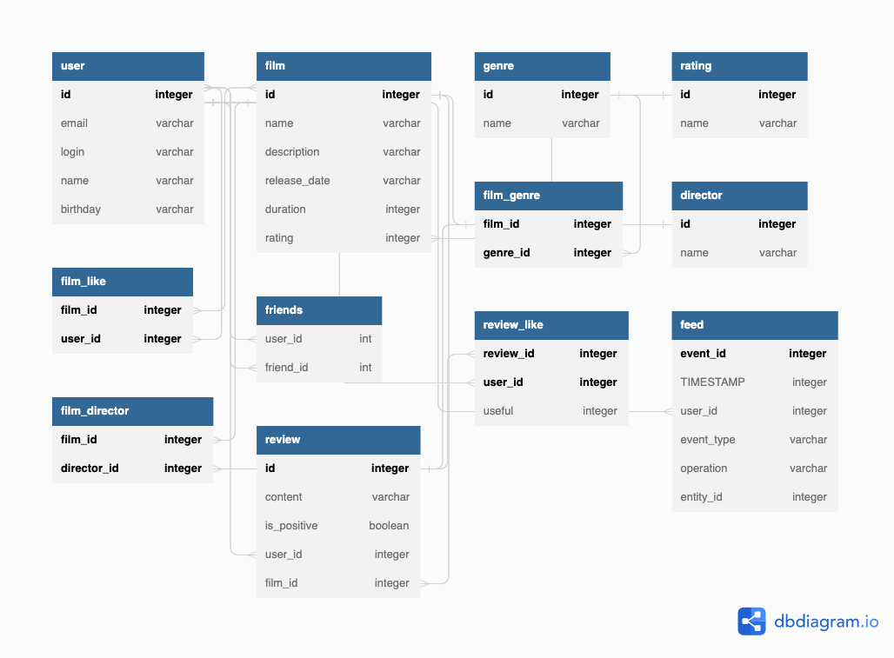

# java-filmorate
Template repository for Filmorate project.

В данной версии внесен новый функционал по ТЗ-12:
- Реализована простая рекомендательная система для фильмов.
- Добавлены отзывы на фильмыю
- Реализованы поиск по названию фильмов и по режиссёру.
- Реализован вывод общих с другом фильмов с сортировкой по их популярности.
- Добавлена возможность просмотра последних событий на платформе.
- Добавлена функциональность для удаления фильма и пользователя по идентификатору.
- В информацию о фильмах добавлено имя режиссёра.
- Добавилена возможность выводить топ-N фильмов по количеству лайков.

 Данная схема базы данных предоставляет функционал хранениен сущностей User и Film,
а так же: лайкать фильмы, добавлять других пользователей в друзья с подтверждением дружбы
и получения списка популярных фильмов.

Примеры основных SQL запросов для сущности User : 

"SELECT * FROM "user"",

"UPDATE "user" SET email = ?, login = ?, name = ?, birthday = ? WHERE id=? ",

"SELECT * FROM "user" WHERE id=?",

"DELETE FROM "user" WHERE ID = ?"

Для сущности Film : 

"SELECT f.id, f.name, description, release_date, duration, r.ID AS rating_id, r.NAME AS rating_name 
FROM "film" AS f 
LEFT JOIN "rating" r on f.RATING_ID = r.ID "

"UPDATE "film" SET NAME = ?, DESCRIPTION = ?, RELEASE_DATE = ?, DURATION = ? , RATING_ID = ? WHERE ID = ? "

"DELETE FROM "film_genre" WHERE FILM_ID=? AND GENRE_ID=?"